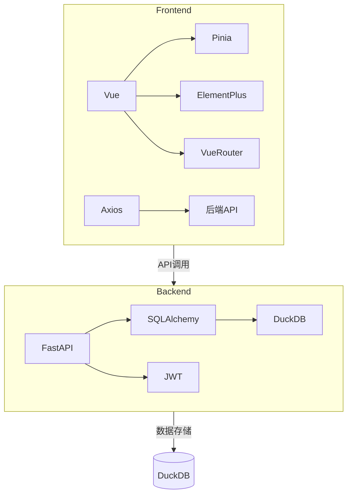

# 多用户隔离个人任务管理系统技术栈规范 v1.0

## 🏗️ 技术架构
采用前后端分离架构：
- 前端：Vue3单页应用
- 后端：FastAPI RESTful服务
- 数据库：DuckDB嵌入式数据库

## 💻 前端技术栈
### 核心框架
- Vue 3.4+ (Composition API)
- Vite 5.0+ (构建工具)
- Pinia 2.1+ (状态管理)
- Vue Router 4.2+ (路由)

### UI组件库
- Element Plus 2.4+ (完整组件库)
- @element-plus/icons-vue (图标库)

### 辅助工具
- Axios 1.6+ (HTTP客户端)
- Marked 7.0+ (Markdown渲染)
- Day.js 1.11+ (日期处理)

### 开发工具
- ESLint (代码规范)
- Prettier (代码格式化)
- TypeScript 5.3+ (可选)

## 🖥️ 后端技术栈
### 核心框架
- FastAPI 0.109+ (Web框架)
- Uvicorn 0.27+ (ASGI服务器)
- Python 3.11+ (运行时)

### 数据存储
- DuckDB 0.10+ (嵌入式数据库)
- SQLAlchemy 2.0+ (ORM)
- Alembic 1.13+ (数据库迁移)

### 安全认证
- JWT (JSON Web Tokens)
- Passlib (密码哈希)
- python-jose (JWT实现)

### 辅助工具
- Pydantic 2.6+ (数据验证)
- Loguru (日志记录)
- pytest (单元测试)

## 📦 开发环境要求
### 前端
- Node.js 20+
- npm 10+ 或 pnpm 8+
- 现代浏览器(Chrome 120+, Edge 120+, Firefox 120+)

### 后端
- Python 3.11+
- pip 23+
- DuckDB CLI (开发调试)

## 🔗 依赖关系图


## ⚙️ 配置规范
### 前端配置
```javascript
// vite.config.js 基础配置
export default defineConfig({
  plugins: [
    vue(),
    ElementPlus({
      // 按需导入配置
      importStyle: 'css',
      resolvers: [ElementPlusResolver()]
    })
  ],
  resolve: {
    alias: {
      '@': path.resolve(__dirname, './src')
    }
  }
})
```

### 后端配置
```python
# config.py 基础配置
from pydantic_settings import BaseSettings

class Settings(BaseSettings):
    DATABASE_URL: str = "duckdb:///:memory:"
    SECRET_KEY: str = "your-secret-key"
    ALGORITHM: str = "HS256"
    ACCESS_TOKEN_EXPIRE_MINUTES: int = 30

settings = Settings()
```

## 📌 编码规范
### 前端规范
1. 组件命名：PascalCase (如 `TaskList.vue`)
2. 状态管理：使用Pinia stores组织业务逻辑
3. API调用：统一在`src/api`目录下管理
4. 样式：使用Scoped CSS或CSS Modules

### 后端规范
1. 路由：按功能模块分组 (如`/api/users`, `/api/tasks`)
2. 错误处理：统一错误响应格式
3. 数据库操作：使用SQLAlchemy ORM
4. 认证：所有API路由需JWT验证(登录注册除外)

## 🚀 部署方案
### 开发模式
```bash
# 前端
npm run dev

# 后端
uvicorn main:app --reload
```

### 生产部署
1. 前端：`npm run build`生成静态文件，部署到Nginx
2. 后端：使用Gunicorn+Uvicorn部署
3. 数据库：DuckDB单文件存储，定期备份

## 📚 参考文档
- [Vue3官方文档](https://vuejs.org/)
- [FastAPI文档](https://fastapi.tiangolo.com/)
- [DuckDB文档](https://duckdb.org/docs/)
- [Element Plus文档](https://element-plus.org/)
