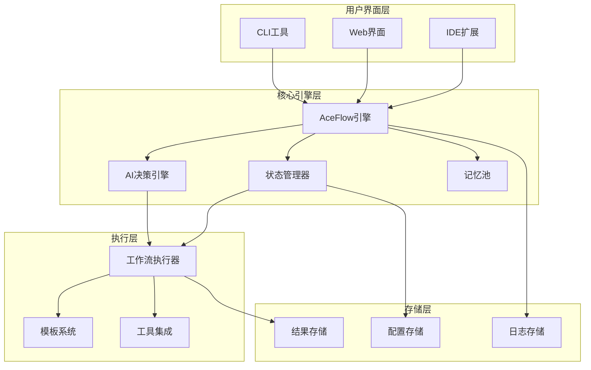

# AceFlow v3.0 完整规范文档

> **版本**: v3.0.0  
> **更新时间**: 2025-07-11  
> **类型**: 统一技术规范  
> **适用范围**: AI驱动的软件开发工作流管理系统

## 🎯 系统概述

AceFlow v3.0是一个AI驱动的软件开发工作流管理系统，结合PATEOAS（Prompt as the Engine of AI State）理念和传统软件工程最佳实践，提供智能化、标准化、可扩展的开发流程管理。

### 核心理念
- **智能自适应**: AI根据任务特征自动选择最优执行路径
- **状态驱动**: 基于项目状态和上下文进行工作流管理
- **分层架构**: 系统规范、AI执行、实战模板三层分离
- **标准化**: 统一的文件格式、路径规范和输出标准

## 📋 v3.0 新特性

### 🆕 主要改进
1. **智能模式选择**: AI自动分析任务复杂度，推荐最佳流程模式
2. **统一CLI工具**: 完整的命令行界面，支持所有操作
3. **Web可视化**: 实时状态展示和进度监控
4. **IDE深度集成**: VSCode、Cursor等主流IDE原生支持
5. **记忆池系统**: 跨项目知识积累和学习能力

### 🔄 架构升级
- **模块化设计**: 核心引擎、扩展插件、用户界面分离
- **标准化接口**: RESTful API和WebSocket实时通信
- **容器化部署**: Docker支持，一键部署
- **多语言支持**: Python、Node.js、Java、Go等主流技术栈

## 🏗️ 系统架构

### 1. 整体架构图


### 2. 核心组件

#### 2.1 AceFlow引擎
```yaml
核心功能:
  - 流程模式自动选择
  - 任务分发和调度
  - 状态同步和管理
  - 异常处理和恢复

技术实现:
  - 位置: .aceflow/engine/
  - 语言: Python 3.8+
  - 依赖: FastAPI, Pydantic, AsyncIO
```

#### 2.2 AI决策引擎
```yaml
核心功能:
  - 任务类型识别
  - 复杂度评估
  - 流程路径推荐
  - 智能提示生成

技术实现:
  - 位置: .aceflow/ai/
  - 模型: 本地LLM + 云端API
  - 支持: OpenAI, Claude, Gemini
```

#### 2.3 状态管理器
```yaml
核心功能:
  - 项目状态跟踪
  - 进度计算
  - 历史记录
  - 状态回滚

数据格式:
  - 主状态: .aceflow/state/project_state.json
  - 历史: .aceflow/state/history/
  - 快照: .aceflow/state/snapshots/
```

## 🔧 流程模式规范

### 1. 智能模式 (Smart Mode)
**代码标识**: `smart`  
**特点**: AI自动选择最优流程，动态调整执行路径

#### 流程决策逻辑
```python
def select_workflow_mode(task_description, project_context):
    """
    智能选择工作流模式
    """
    complexity = analyze_complexity(task_description)
    team_size = project_context.team_size
    urgency = detect_urgency(task_description)
    
    if urgency == "emergency":
        return "emergency"  # 紧急模式: S4↔S5→S6→S8
    elif complexity == "low" and team_size <= 5:
        return "minimal"    # 轻量模式: P→D→R
    elif complexity == "medium" or team_size <= 10:
        return "standard"   # 标准模式: P1→P2→D1→D2→R1
    else:
        return "complete"   # 完整模式: S1→S8全流程
```

### 2. 轻量级模式 (Minimal Mode)
**代码标识**: `minimal`  
**适用场景**: 1-5人团队，快速迭代，Bug修复  
**典型周期**: 0.5-2天

```yaml
工作流: P → D → R

P (Planning/规划):
  执行时间: 2-4小时
  核心目标: 快速分析、简单设计
  AI提示: "快速模式规划，重点关注核心功能实现"
  输出路径: /aceflow_result/{iteration_id}/minimal/planning/

D (Development/开发):
  执行时间: 4-12小时
  核心目标: 快速编码、即时测试
  AI提示: "敏捷开发，边写边测，快速验证"
  输出路径: /aceflow_result/{iteration_id}/minimal/development/

R (Review/评审):
  执行时间: 1-2小时
  核心目标: 基本验证、简单文档
  AI提示: "轻量级评审，确保功能正常"
  输出路径: /aceflow_result/{iteration_id}/minimal/review/
```

### 3. 标准模式 (Standard Mode)
**代码标识**: `standard`  
**适用场景**: 3-10人团队，企业应用，新功能开发  
**典型周期**: 3-7天

```yaml
工作流: P1 → P2 → D1 → D2 → R1

P1 (需求分析):
  执行时间: 4-8小时
  核心目标: 详细需求分析、用户故事
  AI提示: "深入分析用户需求，编写清晰的用户故事"
  输出路径: /aceflow_result/{iteration_id}/standard/requirements/

P2 (技术设计):
  执行时间: 4-8小时
  核心目标: 架构设计、接口定义
  AI提示: "设计技术方案，定义接口和数据结构"
  输出路径: /aceflow_result/{iteration_id}/standard/design/

D1 (功能开发):
  执行时间: 1-3天
  核心目标: 核心功能实现
  AI提示: "按设计文档实现功能，保持代码质量"
  输出路径: /aceflow_result/{iteration_id}/standard/implementation/

D2 (测试验证):
  执行时间: 4-8小时
  核心目标: 全面测试、性能优化
  AI提示: "执行完整测试，包括单元测试和集成测试"
  输出路径: /aceflow_result/{iteration_id}/standard/testing/

R1 (发布准备):
  执行时间: 2-4小时
  核心目标: 代码审查、文档整理
  AI提示: "准备发布，整理文档和部署说明"
  输出路径: /aceflow_result/{iteration_id}/standard/release/
```

### 4. 完整模式 (Complete Mode)
**代码标识**: `complete`  
**适用场景**: 10+人团队，关键系统，复杂项目  
**典型周期**: 1-4周

```yaml
工作流: S1 → S2 → S3 → S4 → S5 → S6 → S7 → S8

S1 (用户故事):
  执行时间: 1-2天
  核心目标: 完整用户故事分析
  AI执行提示: |
    ## 任务：S1 - 用户故事细化
    
    ### 执行目标
    将用户需求转换为符合INVEST原则的完整用户故事集合
    
    ### 输入分析
    - 分析用户原始需求描述
    - 识别所有相关用户角色和场景
    
    ### 执行步骤
    1. 用户角色识别和分析
    2. 核心功能场景梳理
    3. 用户故事编写（格式：作为[角色]，我希望[功能]，以便[价值]）
    4. INVEST原则验证（Independent, Negotiable, Valuable, Estimable, Small, Testable）
    5. 用户故事优先级排序
    
    ### 输出要求
    - 用户故事文档: /aceflow_result/{iteration_id}/S1_user_stories/user_stories.md
    - 角色分析报告: /aceflow_result/{iteration_id}/S1_user_stories/user_roles.md
    - 优先级矩阵: /aceflow_result/{iteration_id}/S1_user_stories/priority_matrix.md
    
    ### 质量标准
    - 每个故事都符合INVEST原则
    - 包含明确的验收标准
    - 优先级分类清晰合理

S2 (任务拆分):
  执行时间: 1-2天
  核心目标: 详细任务分解和规划
  AI执行提示: |
    ## 任务：S2 - 任务拆分与规划
    
    ### 执行目标
    将用户故事分解为可执行的开发任务
    
    ### 输入依赖
    - S1输出：用户故事文档
    - 项目配置：.aceflow/config.yaml
    
    ### 执行步骤
    1. 分析每个用户故事的技术实现需求
    2. 拆分为独立的开发任务（目标：单个任务≤8小时）
    3. 识别任务间的依赖关系
    4. 评估任务复杂度和风险
    5. 制定执行计划和时间表
    
    ### 输出要求
    - 主任务清单: /aceflow_result/{iteration_id}/S2_tasks/task_list.md
    - 任务详情: /aceflow_result/{iteration_id}/S2_tasks/tasks/{task_id}.md
    - 依赖关系图: /aceflow_result/{iteration_id}/S2_tasks/dependencies.md
    - 执行计划: /aceflow_result/{iteration_id}/S2_tasks/execution_plan.md
    
    ### 质量标准
    - 任务粒度合适，可独立完成
    - 依赖关系清晰明确
    - 包含风险评估和应对措施

S3 (测试设计):
  执行时间: 1-2天
  核心目标: 完整测试策略和用例设计
  AI执行提示: |
    ## 任务：S3 - 测试用例设计
    
    ### 执行目标
    为所有用户故事和开发任务设计完整的测试用例
    
    ### 输入依赖
    - S1输出：用户故事和验收标准
    - S2输出：开发任务列表
    
    ### 执行步骤
    1. 分析用户故事的验收标准
    2. 设计测试场景：正常流程、边界条件、异常场景
    3. 编写详细测试步骤
    4. 标注自动化测试可行性
    5. 设计性能和安全测试用例
    
    ### 输出要求
    - 测试策略: /aceflow_result/{iteration_id}/S3_testing/test_strategy.md
    - 功能测试用例: /aceflow_result/{iteration_id}/S3_testing/functional_tests.md
    - 自动化测试脚本: /aceflow_result/{iteration_id}/S3_testing/automation/
    - 性能测试用例: /aceflow_result/{iteration_id}/S3_testing/performance_tests.md
    
    ### 质量标准
    - 测试覆盖率≥80%
    - 包含边界和异常场景
    - 自动化测试脚本可执行

S4-S5 (开发测试循环):
  执行时间: 3-10天
  核心目标: 迭代式开发和测试
  AI执行提示: |
    ## 任务：S4-S5 - 开发测试循环
    
    ### 执行目标
    以任务为单位进行迭代式开发和测试，直到所有任务完成
    
    ### 循环控制逻辑
    ```python
    while has_pending_tasks():
        task = select_next_task()  # 基于依赖关系和优先级
        
        # S4: 功能实现
        implement_task(task)
        create_implementation_report(task)
        
        # S5: 测试验证
        test_results = execute_tests(task)
        
        if test_results.passed:
            mark_task_completed(task)
            update_progress()
        else:
            analyze_failures(test_results)
            fix_issues(task)
            # 重新测试
    ```
    
    ### S4 实现阶段
    **输入**: 任务描述、设计文档、测试用例
    **执行**:
    1. 编写功能代码，遵循项目编码规范
    2. 实现单元测试
    3. 进行代码自检和格式化
    4. 创建实现文档
    
    **输出**:
    - 功能代码: 项目源码目录
    - 实现报告: /aceflow_result/{iteration_id}/S4_implementation/impl_{task_id}.md
    - 单元测试: 项目测试目录
    
    ### S5 测试阶段
    **输入**: 实现代码、测试用例
    **执行**:
    1. 运行单元测试
    2. 执行集成测试
    3. 检查代码覆盖率
    4. 性能测试（如需要）
    5. 生成测试报告
    
    **输出**:
    - 测试报告: /aceflow_result/{iteration_id}/S5_testing/test_{task_id}.md
    - 覆盖率报告: /aceflow_result/{iteration_id}/S5_testing/coverage/
    - 缺陷报告: /aceflow_result/{iteration_id}/S5_testing/defects/
    
    ### 质量标准
    - 单元测试覆盖率≥80%
    - 所有测试用例必须通过
    - 代码符合项目规范

S6 (代码评审):
  执行时间: 1-2天
  核心目标: 全面代码质量检查
  AI执行提示: |
    ## 任务：S6 - 代码评审
    
    ### 执行目标
    对本次迭代的所有代码进行全面质量评审
    
    ### 评审范围
    - 本次迭代新增和修改的所有源码文件
    - 测试代码和配置文件
    - 文档和注释
    
    ### 评审清单
    1. **代码质量**
       - 命名规范性
       - 代码格式和风格
       - 注释完整性和准确性
    
    2. **逻辑正确性**
       - 业务逻辑实现正确性
       - 边界条件处理
       - 错误处理机制
    
    3. **性能和安全**
       - 性能潜在问题
       - 安全漏洞检查
       - 资源使用优化
    
    4. **可维护性**
       - 代码复杂度控制
       - 重复代码消除
       - 设计模式应用
    
    ### 工具支持
    - 静态代码分析：SonarLint, ESLint, Pylint
    - 安全扫描：SAST工具
    - 性能分析：Profiler工具
    
    ### 输出要求
    - 评审报告: /aceflow_result/{iteration_id}/S6_review/code_review.md
    - 问题清单: /aceflow_result/{iteration_id}/S6_review/issues.md
    - 改进建议: /aceflow_result/{iteration_id}/S6_review/improvements.md
    
    ### 质量标准
    - 无严重安全漏洞
    - 代码复杂度在可接受范围
    - 所有建议问题都有解决方案

S7 (演示反馈):
  执行时间: 0.5-1天
  核心目标: 用户演示和反馈收集
  AI执行提示: |
    ## 任务：S7 - 演示与反馈收集
    
    ### 执行目标
    准备功能演示并收集用户反馈
    
    ### 准备工作
    1. **演示环境搭建**
       - 部署最新功能到演示环境
       - 准备演示数据
       - 测试演示流程
    
    2. **演示脚本编写**
       - 功能亮点概述
       - 核心使用场景演示
       - 性能和质量指标展示
    
    3. **反馈收集机制**
       - 设计反馈问卷
       - 准备反馈收集工具
       - 制定反馈分析方法
    
    ### 输出要求
    - 演示脚本: /aceflow_result/{iteration_id}/S7_demo/demo_script.md
    - 演示环境: /aceflow_result/{iteration_id}/S7_demo/demo_setup.md
    - 反馈模板: /aceflow_result/{iteration_id}/S7_demo/feedback_template.md
    - 反馈收集: /aceflow_result/{iteration_id}/S7_demo/feedback_results.md
    
    ### 质量标准
    - 演示流程流畅完整
    - 反馈收集覆盖全面
    - 问题和建议分类清晰

S8 (总结归档):
  执行时间: 0.5天
  核心目标: 项目总结和知识沉淀
  AI执行提示: |
    ## 任务：S8 - 项目总结与知识归档
    
    ### 执行目标
    总结本次迭代成果，沉淀经验知识
    
    ### 数据收集
    - 所有阶段的执行数据和产出物
    - 时间消耗和效率指标
    - 问题和解决方案记录
    - 用户反馈和满意度
    
    ### 分析维度
    1. **执行效率分析**
       - 各阶段时间消耗
       - 任务完成质量
       - 流程瓶颈识别
    
    2. **质量评估**
       - 缺陷数量和类型
       - 测试覆盖率达成
       - 用户满意度
    
    3. **经验总结**
       - 最佳实践提取
       - 问题和教训总结
       - 改进建议
    
    ### 输出要求
    - 迭代总结: /aceflow_result/{iteration_id}/S8_summary/iteration_summary.md
    - 效率分析: /aceflow_result/{iteration_id}/S8_summary/efficiency_analysis.md
    - 质量报告: /aceflow_result/{iteration_id}/S8_summary/quality_report.md
    - 经验知识库: /.aceflow/memory/LEARN-{iteration_id}.md
    
    ### 知识归档
    - 更新项目知识库
    - 提取可复用的模板和工具
    - 记录最佳实践和经验教训
```

### 5. 紧急模式 (Emergency Mode)
**代码标识**: `emergency`  
**适用场景**: 生产环境紧急修复  
**典型周期**: 2-8小时

```yaml
工作流: 快速分析 → 最小修复 → 即时测试 → 紧急发布

执行特点:
  - 跳过非必要文档
  - 聚焦核心问题修复
  - 最小化影响范围
  - 快速验证和部署
```

## 🤖 AI集成规范

### 1. 智能决策系统

#### 1.1 任务分类算法
```python
class TaskClassifier:
    def __init__(self):
        self.keywords = {
            'bug_fix': ['修复', 'fix', 'bug', '问题', '错误', '异常', '报错'],
            'feature': ['新功能', '添加', '实现', '开发', '需要', '增加'],
            'refactor': ['重构', '优化', '改进', '重写', '调整'],
            'emergency': ['紧急', '线上', '生产', 'urgent', 'critical', '故障']
        }
    
    def classify(self, description, context):
        """
        分析任务描述，返回任务类型和推荐模式
        """
        # 关键词匹配
        task_type = self._keyword_analysis(description)
        
        # 复杂度评估
        complexity = self._complexity_analysis(description, context)
        
        # 紧急程度判断
        urgency = self._urgency_analysis(description)
        
        # 推荐模式
        recommended_mode = self._recommend_mode(task_type, complexity, urgency)
        
        return {
            'task_type': task_type,
            'complexity': complexity,
            'urgency': urgency,
            'recommended_mode': recommended_mode,
            'confidence': 0.85
        }
```

#### 1.2 上下文理解
```python
class ContextAnalyzer:
    def analyze_project_context(self, project_path):
        """
        分析项目上下文信息
        """
        return {
            'technology_stack': self._detect_tech_stack(project_path),
            'project_size': self._estimate_project_size(project_path),
            'team_size': self._estimate_team_size(project_path),
            'development_stage': self._detect_dev_stage(project_path),
            'last_activity': self._get_last_activity(project_path)
        }
```

### 2. 提示词优化系统

#### 2.1 动态提示生成
```python
class PromptGenerator:
    def generate_stage_prompt(self, stage, context, task_info):
        """
        基于阶段、上下文和任务信息生成优化的AI提示
        """
        base_prompt = self.load_template(f"prompts/{stage}.md")
        
        # 上下文注入
        context_vars = {
            'project_type': context.technology_stack,
            'complexity': task_info.complexity,
            'iteration_id': context.iteration_id,
            'previous_outputs': self._get_previous_outputs(context)
        }
        
        # 动态调整
        if task_info.urgency == 'high':
            base_prompt += self.load_template("prompts/urgency_addon.md")
        
        return base_prompt.format(**context_vars)
```

#### 2.2 学习优化
```python
class PromptOptimizer:
    def optimize_based_on_feedback(self, stage, prompt, execution_result, feedback):
        """
        基于执行结果和反馈优化提示词
        """
        # 分析执行效果
        effectiveness = self._analyze_effectiveness(execution_result, feedback)
        
        # 识别改进点
        improvement_areas = self._identify_improvements(prompt, effectiveness)
        
        # 生成优化建议
        optimization_suggestions = self._generate_optimizations(improvement_areas)
        
        # 更新提示词模板
        self._update_template(stage, optimization_suggestions)
```

## 🔧 CLI工具规范

### 1. 核心命令

#### 1.1 项目管理
```bash
# 初始化项目
aceflow init [--mode smart|minimal|standard|complete] [--template <template_name>]

# 项目状态查询
aceflow status [--format text|json|yaml] [--verbose] [--stage <stage_id>]

# 项目配置
aceflow config [--set <key=value>] [--get <key>] [--list]
```

#### 1.2 流程控制
```bash
# 开始新的迭代
aceflow start [--description "task description"] [--mode <mode>] [--auto]

# 执行特定阶段
aceflow run <stage_id> [--force] [--dry-run] [--auto-docs]

# 更新进度
aceflow progress <stage_id> <percentage> [--note "progress note"]

# 完成阶段
aceflow complete <stage_id> [--auto-next] [--generate-report]
```

#### 1.3 AI增强功能
```bash
# AI任务分析和建议
aceflow analyze "task description" [--context <context_file>]

# 智能流程推荐
aceflow suggest [--project-type <type>] [--team-size <size>]

# AI执行助手
aceflow assist <stage_id> [--interactive] [--auto-execute]

# 记忆管理
aceflow memory [--add <content>] [--search <query>] [--export]
```

#### 1.4 监控和报告
```bash
# 实时监控
aceflow monitor [--dashboard] [--interval <seconds>]

# 生成报告
aceflow report [--type summary|detailed|timeline] [--export pdf|html|md]

# 性能分析
aceflow metrics [--period <days>] [--compare <iteration_id>]
```

#### 1.5 集成和扩展
```bash
# Web界面
aceflow web [--port <port>] [--host <host>] [--auth]

# IDE集成
aceflow ide setup [--editor vscode|cursor|vim] [--workspace <path>]

# 插件管理
aceflow plugin [install|remove|list] [<plugin_name>]

# 数据导入导出
aceflow export [--format json|yaml|csv] [--output <file>]
aceflow import <file> [--merge] [--validate]
```

### 2. 输出格式规范

#### 2.1 状态查询JSON格式
```json
{
  "project": {
    "id": "project_uuid",
    "name": "project_name",
    "path": "/absolute/path/to/project",
    "technology_stack": ["python", "fastapi", "postgresql"],
    "created_at": "2025-07-11T10:00:00Z",
    "last_updated": "2025-07-11T15:30:00Z"
  },
  "flow": {
    "mode": "smart",
    "selected_mode": "standard",
    "current_stage": "S4",
    "current_stage_name": "功能实现",
    "overall_progress": 65.5,
    "stage_progress": 80,
    "estimated_completion": "2025-07-13T18:00:00Z"
  },
  "stages": {
    "S1": {
      "name": "用户故事",
      "status": "completed",
      "progress": 100,
      "start_time": "2025-07-11T10:00:00Z",
      "end_time": "2025-07-11T16:00:00Z",
      "duration_hours": 6,
      "deliverables": [
        "/aceflow_result/iter_001/S1_user_stories/user_stories.md",
        "/aceflow_result/iter_001/S1_user_stories/user_roles.md"
      ],
      "quality_score": 95.5
    }
  },
  "ai": {
    "ready": true,
    "last_analysis": "2025-07-11T15:00:00Z",
    "confidence": 0.92,
    "suggestions": [
      {
        "type": "optimization",
        "stage": "S4",
        "priority": "medium",
        "description": "考虑使用缓存优化查询性能",
        "estimated_impact": "15% performance improvement"
      }
    ]
  },
  "health": {
    "overall": "good",
    "issues": [],
    "warnings": [
      "S3阶段测试覆盖率偏低(75%)"
    ],
    "recommendations": [
      "建议增加边界条件测试用例"
    ]
  },
  "next_actions": [
    {
      "action": "continue_implementation",
      "stage": "S4",
      "command": "aceflow run S4 --auto",
      "priority": "high",
      "description": "继续完成剩余的功能实现任务"
    }
  ]
}
```

#### 2.2 错误处理格式
```json
{
  "error": true,
  "error_code": "STAGE_DEPENDENCY_NOT_MET",
  "error_message": "无法开始S4阶段：S3阶段未完成",
  "details": {
    "required_stage": "S3",
    "current_progress": 75,
    "missing_deliverables": [
      "/aceflow_result/iter_001/S3_testing/test_strategy.md"
    ]
  },
  "suggestions": [
    {
      "action": "complete_s3",
      "command": "aceflow run S3 --auto",
      "description": "完成S3阶段的测试用例设计"
    }
  ],
  "help_url": "https://docs.aceflow.dev/errors/STAGE_DEPENDENCY_NOT_MET"
}
```

## 📁 文件系统规范

### 1. 目录结构
```
project_root/
├── .aceflow/                           # AceFlow核心目录
│   ├── engine/                         # 核心引擎
│   │   ├── __init__.py
│   │   ├── workflow_engine.py          # 工作流引擎
│   │   ├── ai_engine.py                # AI决策引擎
│   │   └── state_manager.py            # 状态管理器
│   ├── ai/                             # AI模块
│   │   ├── classifiers/                # 任务分类器
│   │   ├── prompts/                    # 提示词模板
│   │   ├── optimizers/                 # 优化器
│   │   └── memory/                     # AI记忆系统
│   ├── config/                         # 配置文件
│   │   ├── project.yaml                # 项目配置
│   │   ├── modes.yaml                  # 流程模式配置
│   │   ├── ai_settings.yaml            # AI设置
│   │   └── integrations.yaml           # 集成配置
│   ├── templates/                      # 模板系统
│   │   ├── prompts/                    # AI提示词模板
│   │   │   ├── S1_user_stories.md
│   │   │   ├── S2_task_breakdown.md
│   │   │   ├── S3_test_design.md
│   │   │   ├── S4_implementation.md
│   │   │   ├── S5_testing.md
│   │   │   ├── S6_code_review.md
│   │   │   ├── S7_demo_feedback.md
│   │   │   └── S8_summary.md
│   │   ├── documents/                  # 文档模板
│   │   │   ├── user_story_template.md
│   │   │   ├── task_template.md
│   │   │   ├── test_case_template.md
│   │   │   ├── implementation_report.md
│   │   │   ├── test_report.md
│   │   │   ├── code_review.md
│   │   │   ├── demo_script.md
│   │   │   └── summary_report.md
│   │   └── code/                       # 代码模板
│   │       ├── python/
│   │       ├── javascript/
│   │       ├── java/
│   │       └── go/
│   ├── scripts/                        # 工具脚本
│   │   ├── aceflow                     # 主CLI工具
│   │   ├── init.py                     # 初始化脚本
│   │   ├── state_manager.py            # 状态管理脚本
│   │   ├── analyzer.py                 # 分析脚本
│   │   ├── reporter.py                 # 报告生成器
│   │   └── optimizer.py                # 优化器
│   ├── state/                          # 状态存储
│   │   ├── project_state.json          # 主状态文件
│   │   ├── history/                    # 历史记录
│   │   ├── snapshots/                  # 状态快照
│   │   └── cache/                      # 缓存文件
│   ├── memory/                         # 记忆池
│   │   ├── requirements/               # 需求记忆
│   │   ├── decisions/                  # 决策记忆
│   │   ├── issues/                     # 问题记忆
│   │   ├── learning/                   # 学习记忆
│   │   └── context/                    # 上下文记忆
│   ├── logs/                           # 日志文件
│   │   ├── aceflow.log                 # 主日志
│   │   ├── ai_decisions.log            # AI决策日志
│   │   ├── performance.log             # 性能日志
│   │   └── errors.log                  # 错误日志
│   ├── web/                            # Web界面
│   │   ├── static/                     # 静态资源
│   │   ├── templates/                  # 页面模板
│   │   └── app.py                      # Web应用
│   └── plugins/                        # 插件系统
│       ├── __init__.py
│       ├── plugin_manager.py
│       └── plugins/                    # 插件目录
├── aceflow_result/                     # 执行结果目录
│   ├── iter_001/                       # 迭代目录
│   │   ├── S1_user_stories/            # S1阶段输出
│   │   ├── S2_tasks/                   # S2阶段输出
│   │   ├── S3_testing/                 # S3阶段输出
│   │   ├── S4_implementation/          # S4阶段输出
│   │   ├── S5_testing/                 # S5阶段输出
│   │   ├── S6_review/                  # S6阶段输出
│   │   ├── S7_demo/                    # S7阶段输出
│   │   └── S8_summary/                 # S8阶段输出
│   └── iter_002/                       # 下一个迭代
├── .vscode/                            # VSCode配置
│   ├── settings.json                   # 编辑器设置
│   ├── tasks.json                      # 任务配置
│   ├── launch.json                     # 调试配置
│   └── extensions.json                 # 推荐扩展
├── .clinerules/                        # AI Agent集成
│   ├── aceflow_integration.md          # 集成规则
│   └── custom_prompts.md               # 自定义提示
└── aceflow-workspace.code-workspace    # 工作区配置
```

### 2. 配置文件规范

#### 2.1 项目配置 (.aceflow/config/project.yaml)
```yaml
project:
  id: "proj_${timestamp}_${random}"
  name: "项目名称"
  description: "项目描述"
  version: "1.0.0"
  technology_stack:
    - python
    - fastapi
    - postgresql
    - redis
  team:
    size: 5
    roles:
      - "前端开发"
      - "后端开发"
      - "测试工程师"
      - "产品经理"
      - "架构师"

aceflow:
  version: "3.0.0"
  default_mode: "smart"
  auto_mode_selection: true
  ai_assistance_level: "L2"  # L1=建议, L2=执行, L3=自主
  
workflow:
  iteration_prefix: "iter"
  auto_generate_iteration_id: true
  stage_timeout_hours: 24
  auto_progress_tracking: true
  quality_gates_enabled: true

output:
  base_path: "./aceflow_result"
  file_format: "markdown"
  include_timestamps: true
  auto_backup: true
  retention_days: 90

integrations:
  ide:
    enabled: true
    type: "vscode"
    auto_sync: true
  ai_providers:
    primary: "openai"
    fallback: "claude"
    local_llm: false
  tools:
    git: true
    docker: true
    ci_cd: "github_actions"

quality:
  code_review:
    required: true
    auto_analysis: true
    tools: ["sonarqube", "eslint"]
  testing:
    min_coverage: 80
    auto_test: true
    performance_testing: true
  security:
    vulnerability_scan: true
    secrets_detection: true
    compliance_check: true
```

#### 2.2 AI设置 (.aceflow/config/ai_settings.yaml)
```yaml
ai:
  providers:
    openai:
      api_key: "${OPENAI_API_KEY}"
      model: "gpt-4"
      max_tokens: 4096
      temperature: 0.1
    claude:
      api_key: "${CLAUDE_API_KEY}"
      model: "claude-3-sonnet"
      max_tokens: 4096
    local:
      enabled: false
      model_path: ""
      
  decision_engine:
    confidence_threshold: 0.8
    auto_execution_threshold: 0.9
    learning_enabled: true
    feedback_collection: true
    
  prompts:
    template_version: "3.0"
    customization_enabled: true
    optimization_enabled: true
    context_injection: true
    
  memory:
    enabled: true
    retention_policy: "smart"  # smart, all, minimal
    max_memory_size: "1GB"
    auto_cleanup: true
```

## 🌐 Web界面规范

### 1. 功能模块
```yaml
Dashboard:
  - 项目状态概览
  - 实时进度展示
  - AI建议面板
  - 性能指标图表

Project Management:
  - 项目列表和创建
  - 配置管理
  - 模式选择
  - 团队管理

Workflow Control:
  - 流程可视化
  - 阶段执行控制
  - 进度更新
  - 异常处理

AI Assistant:
  - 智能分析面板
  - 任务分类结果
  - 推荐建议
  - 学习反馈

Reports & Analytics:
  - 执行报告
  - 效率分析
  - 质量指标
  - 趋势分析

Settings:
  - 系统配置
  - AI设置
  - 集成管理
  - 用户偏好
```

### 2. API规范
```yaml
REST Endpoints:
  # 项目管理
  GET    /api/v3/projects                    # 项目列表
  POST   /api/v3/projects                    # 创建项目
  GET    /api/v3/projects/{id}               # 项目详情
  PUT    /api/v3/projects/{id}               # 更新项目
  DELETE /api/v3/projects/{id}               # 删除项目
  
  # 流程控制
  GET    /api/v3/projects/{id}/status        # 项目状态
  POST   /api/v3/projects/{id}/start         # 开始迭代
  POST   /api/v3/projects/{id}/stages/{stage}/run    # 执行阶段
  PUT    /api/v3/projects/{id}/stages/{stage}/progress # 更新进度
  POST   /api/v3/projects/{id}/stages/{stage}/complete # 完成阶段
  
  # AI服务
  POST   /api/v3/ai/analyze                  # 任务分析
  POST   /api/v3/ai/suggest                  # 获取建议
  POST   /api/v3/ai/optimize                 # 优化建议
  GET    /api/v3/ai/memory                   # 记忆查询
  
  # 报告服务
  GET    /api/v3/reports/{type}              # 生成报告
  GET    /api/v3/analytics/{metric}          # 分析数据
  POST   /api/v3/exports                     # 数据导出

WebSocket Endpoints:
  /ws/projects/{id}/status                   # 状态实时更新
  /ws/projects/{id}/progress                 # 进度实时推送
  /ws/ai/suggestions                         # AI建议推送
  /ws/logs                                   # 日志实时推送
```

## 🔗 集成规范

### 1. IDE集成

#### 1.1 VSCode扩展
```json
{
  "name": "aceflow-vscode",
  "displayName": "AceFlow Integration",
  "description": "VSCode extension for AceFlow workflow management",
  "version": "3.0.0",
  "engines": {
    "vscode": "^1.60.0"
  },
  "categories": ["Other"],
  "activationEvents": [
    "workspaceContains:.aceflow"
  ],
  "main": "./out/extension.js",
  "contributes": {
    "commands": [
      {
        "command": "aceflow.init",
        "title": "Initialize AceFlow",
        "category": "AceFlow"
      },
      {
        "command": "aceflow.status",
        "title": "Show Status",
        "category": "AceFlow"
      },
      {
        "command": "aceflow.run",
        "title": "Run Stage",
        "category": "AceFlow"
      }
    ],
    "views": {
      "explorer": [
        {
          "id": "aceflowStatus",
          "name": "AceFlow Status",
          "when": "aceflowEnabled"
        }
      ]
    },
    "configuration": {
      "title": "AceFlow",
      "properties": {
        "aceflow.autoDetect": {
          "type": "boolean",
          "default": true,
          "description": "Automatically detect AceFlow projects"
        }
      }
    }
  }
}
```

#### 1.2 AI Agent集成规则
```markdown
# .clinerules/aceflow_integration.md

## AceFlow集成规则 v3.0

### 自动检测规则
每次对话开始时，检查以下内容：
1. 是否存在 `.aceflow` 目录
2. 读取项目状态：`.aceflow/state/project_state.json`
3. 分析当前阶段和进度
4. 根据用户输入判断是否需要执行AceFlow流程

### 执行条件
当用户描述符合以下条件时，主动建议或执行AceFlow：
- 包含任务类型关键词（开发、修复、新功能等）
- 描述了具体的开发需求
- 请求项目管理或进度跟踪

### 命令映射
- 用户说"开始新功能开发" → `aceflow start --description "新功能开发"`
- 用户说"检查项目状态" → `aceflow status --format json`
- 用户说"继续当前任务" → `aceflow run current --auto`

### 智能建议
基于项目状态和用户输入，提供：
- 流程模式推荐
- 下一步行动建议
- 潜在问题预警
- 优化建议

### 输出格式
所有AceFlow相关的输出都应该：
- 使用统一的格式
- 包含清晰的状态信息
- 提供可执行的命令建议
- 展示进度和成果
```

## 📊 质量保证规范

### 1. 性能要求
```yaml
响应时间:
  CLI命令: < 2秒
  状态查询: < 500ms
  AI决策: < 3秒
  Web界面: < 1秒
  大文件处理: < 30秒

吞吐量:
  并发用户: 100+
  同时项目: 1000+
  API请求: 1000 req/min
  数据处理: 10MB/s

资源使用:
  内存: < 512MB (基础模式)
  CPU: < 10% (空闲时)
  磁盘: < 100MB (核心文件)
  网络: < 1MB/min (正常使用)
```

### 2. 可靠性要求
```yaml
可用性:
  系统可用率: 99.9%
  故障恢复时间: < 5分钟
  数据备份频率: 每小时
  状态同步延迟: < 1秒

错误处理:
  异常捕获率: 100%
  错误恢复率: 95%
  用户友好提示: 100%
  自动修复能力: 70%

数据完整性:
  状态一致性: 100%
  文件完整性: 100%
  备份可用性: 99.9%
  同步准确性: 100%
```

### 3. 安全要求
```yaml
数据安全:
  API密钥加密存储: 必需
  敏感信息过滤: 必需
  访问控制: 基于角色
  审计日志: 完整记录

网络安全:
  HTTPS通信: 必需
  API认证: Token/OAuth
  防止注入攻击: 必需
  访问频率限制: 必需

文件安全:
  文件权限控制: 必需
  路径安全检查: 必需
  恶意文件检测: 必需
  备份加密: 建议
```

## 🚀 部署和运维

### 1. 安装部署
```bash
# 全局安装
pip install aceflow

# 从源码安装
git clone https://github.com/aceflow/aceflow.git
cd aceflow
pip install -e .

# Docker部署
docker run -v $(pwd):/workspace aceflow/aceflow:3.0

# 验证安装
aceflow --version
aceflow doctor  # 系统健康检查
```

### 2. 配置管理
```bash
# 全局配置
aceflow config global --set ai.provider=openai
aceflow config global --set quality.min_coverage=80

# 项目配置
aceflow config --set workflow.default_mode=smart
aceflow config --set output.format=markdown

# 导入导出配置
aceflow config export --output config.yaml
aceflow config import --file config.yaml
```

### 3. 监控告警
```yaml
监控指标:
  - 系统性能指标
  - 用户活跃度
  - 错误率和响应时间
  - AI决策准确性
  - 资源使用情况

告警规则:
  - 错误率 > 5%
  - 响应时间 > 10秒
  - CPU使用率 > 80%
  - 磁盘空间 < 10%
  - AI服务不可用

日志管理:
  - 结构化日志格式
  - 日志级别分级
  - 自动轮转和清理
  - 集中式日志收集
```

## 📚 扩展和插件

### 1. 插件系统架构
```python
class PluginBase:
    """插件基类"""
    def __init__(self, config):
        self.config = config
    
    def on_stage_start(self, stage, context):
        """阶段开始时的钩子"""
        pass
    
    def on_stage_complete(self, stage, result):
        """阶段完成时的钩子"""
        pass
    
    def on_ai_decision(self, decision, context):
        """AI决策时的钩子"""
        pass

class GitIntegrationPlugin(PluginBase):
    """Git集成插件示例"""
    def on_stage_complete(self, stage, result):
        if stage in ['S4', 'S6']:
            self.auto_commit(stage, result)
    
    def auto_commit(self, stage, result):
        commit_message = f"AceFlow {stage} completed"
        # 执行git操作
```

### 2. 扩展点定义
```yaml
扩展点:
  workflow_engine:
    - stage_lifecycle_hooks
    - custom_stage_definitions
    - flow_control_logic
  
  ai_engine:
    - custom_classifiers
    - prompt_templates
    - decision_algorithms
  
  output_system:
    - custom_formatters
    - report_generators
    - export_handlers
  
  integration_layer:
    - ide_extensions
    - tool_connectors
    - notification_handlers
```

## 🎓 最佳实践

### 1. 项目配置最佳实践
```yaml
建议配置:
  小型项目 (1-3人):
    default_mode: "minimal"
    ai_assistance_level: "L2"
    auto_mode_selection: true
    
  中型项目 (4-10人):
    default_mode: "standard"
    ai_assistance_level: "L2"
    quality_gates_enabled: true
    
  大型项目 (10+人):
    default_mode: "complete"
    ai_assistance_level: "L1"
    code_review.required: true
    security.compliance_check: true
```

### 2. 流程优化建议
```yaml
效率优化:
  - 启用自动模式选择
  - 使用模板加速文档生成
  - 配置质量门控自动化
  - 集成CI/CD流水线

质量优化:
  - 设置合理的覆盖率阈值
  - 启用代码自动检查
  - 配置安全扫描
  - 定期评审AI决策准确性

团队协作:
  - 建立统一的配置标准
  - 定期分享最佳实践
  - 收集和分析团队反馈
  - 持续优化流程模板
```

### 3. 常见问题解决
```yaml
性能问题:
  - 检查AI服务响应时间
  - 清理过期的缓存文件
  - 优化大文件处理逻辑
  - 升级硬件配置

准确性问题:
  - 优化任务描述的清晰度
  - 补充项目上下文信息
  - 调整AI模型参数
  - 收集更多训练数据

集成问题:
  - 检查API密钥配置
  - 验证网络连接
  - 更新依赖版本
  - 查看详细错误日志
```

## 📋 版本管理

### 1. 版本规范
```yaml
版本号格式: MAJOR.MINOR.PATCH
- MAJOR: 重大架构变更，不向后兼容
- MINOR: 新功能添加，向后兼容
- PATCH: Bug修复和小优化

发布周期:
- MAJOR: 6-12个月
- MINOR: 1-2个月
- PATCH: 1-2周
```

### 2. 兼容性策略
```yaml
向后兼容:
  - 配置文件格式兼容3个版本
  - API接口兼容2个主版本
  - CLI命令参数向后兼容
  - 状态文件自动迁移

升级路径:
  - 提供自动升级工具
  - 详细的迁移指南
  - 版本兼容性检查
  - 回滚机制支持
```

---

## 📞 支持和反馈

### 技术支持
- 📚 文档: https://docs.aceflow.dev
- 🐛 问题报告: https://github.com/aceflow/aceflow/issues
- 💬 社区讨论: https://community.aceflow.dev
- 📧 邮件支持: support@aceflow.dev

### 贡献指南
- 🔧 开发指南: [CONTRIBUTING.md](CONTRIBUTING.md)
- 📝 代码规范: [CODE_STYLE.md](CODE_STYLE.md)
- 🧪 测试指南: [TESTING.md](TESTING.md)
- 📦 发布流程: [RELEASE.md](RELEASE.md)

---

*AceFlow v3.0 - 让AI驱动软件开发工作流，提升团队效率和代码质量。*

**© 2025 AceFlow Team. All rights reserved.**